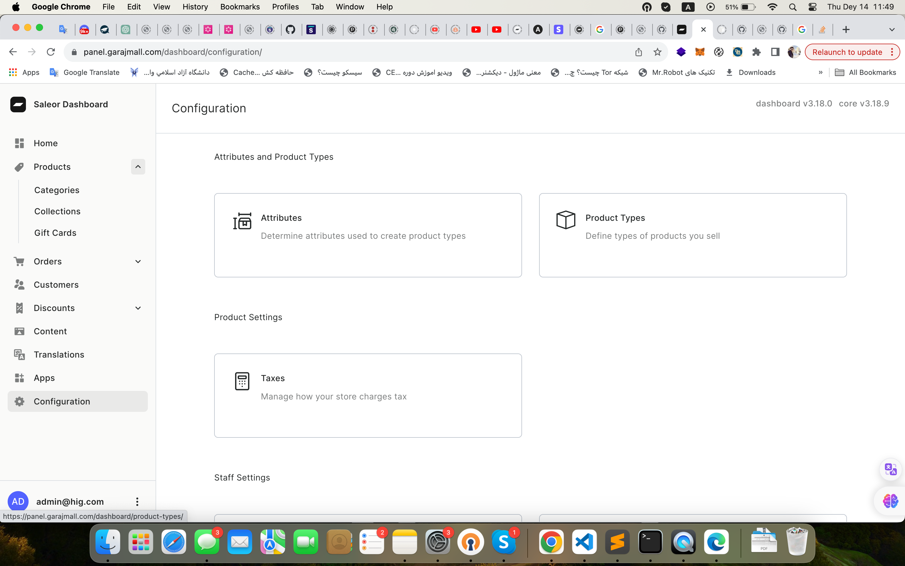

# ساخت محصول

برای ساخت پروداکت اول از همه باید پروداکت تایپ هارو مشخص کنیم که در قسمت configuration میتونیم مشخص کنیم

اگر هر پروداکت تایپی مشخصات خاصی مثل Viscosity, API ...  داشت میتونیم براش در قسمت configuration > attributes بسازیم و نوع دیتاش رو مشخص کنیم
مثلا Viscosity باید multi selected باشه و همینطور attribute value مقدار اون attribute رو مشخص میکنیم

 بعد مشخص کردن attribute ها میتونیم در قسمت product type این attribute هارو بهشون اختصاص بدیم مثلا روغن attribute های Viscosity و API داره

 

بعد از این باید category هارو مشخص کنیم که از کل به جزء میره. بعد اینکه اولین save رو زدیم میره مرحله بعد برای اضافه کردن عکس برای category و subcategory ها مثلا  Automobile category زیر مجموعه هایی مثل کارواش یا روغن یا لاستیک داره که در قسمت پایین صفحه بعد از یکبار save کردن category اصلی میتونیم قسمت subcategory هارو ببینیم و یا اضافه کنیم. 
 

 

 حالا میتونیم محصول بسازیم که اول باید product type رو براش مشخص کنیم که خودش لیستی از product type هارو میاره.
 
 

 
 
 
  بعد از اینکه category و اسم و مشخصات محصول رو وارد کردیم اگر product typi رو انتخاب کرده باشیم که attribute هایی که ساختیم به اون product type تخصیص داده شده بود میتونیم در این قسمت ببینینمش و چون نوع اطلاعاتش multi select هست میتونیم هرچنتا attribute که خواستیم براش انتخاب کنیم.در قسمت پایین تر چنل های موجود رو میبینیم که دوتا هزینه داره هزینه فروش و هزینه تولید یا مصرف شده که به کاربر هزینه فروش یا selling price نشون داده میشه بعد اینکه اولین سیو رو زدیم وارد مرحله بعدی میشه برای ساختproduct variant یا اضافه کردن عکس

 در product variant ها میتونیم نمونه محصول رو در سایز یا رنگ یا قیمت مختلف اضافه کنیم. در این قسمت variants میتونیم قیمت و تعداد (که زیر warehouse) هست رو اضافه کنیم. یا حتی موجودی اون محصول رو با برداشتن یا زدن تیک available معلوم کنیم .

 

